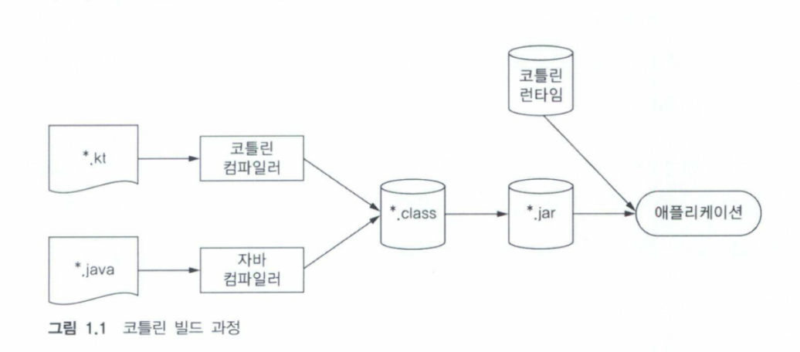

# 1. 코틀린이란 무엇이며, 왜 필요한가?

> 코틀린은 자바 플랫폼에서 돌아가는 프로그래밍 언어다. 코틀린은 간결하고 실용적이며, 자바 코드와의 상호운용성을 중시한다.
>
> 코틀린 언어와 컴파일러, 라이브러리 및 코틀린과 관련된 모든 도구는 모두 오픈소스며, 어떤 목적에든 무료로 사용가능하다.
> 코틀린은 아파치2 라이선스하에 제공된다.

## 목차

1. [코틀린 철학](#코틀린 철학)
2. [코틀린 주요 특성](#코틀린 주요 특성)
3. [코틀린 장점](#코틀린 장점)

## 코틀린 철학

1. 실용성<br/>
   코틀린은 실제 문제를 해결하기 위해 만들어진 실용적인 언어다.<br/>
   연구를 위한 언어는 아니고, 다른 프로그래밍 언어가 채택한 이미 성공적으로 검증된 해법과 기능에 의존한다.<br/>
   IDE 지원과 언어가 동시에 개발되어 항상 도구 활용을 염두에 두고 설계 돼 왔다.
2. 간결성<br/>
   코드를 간단하고 간결하게 내용을 표현한다. 게터, 세터 등과 같은 준비코드를 묵시적으로 제공.
3. 안전성<br/>
   일부 유형의 오류를 프로그램 설계가 원천적으로 방지해준다.<br/>
   코틀린의 경우 컴파일러가 타입을 자동으로 추론해주기 때문에 직접 타입 정보를 지정할 필요가 없다.
   `NullPointerException` 외에도 `ClassCastException`을 방지해준다.

    <details>
     <summary>코틀린의 Type Casting 방식</summary>

   #### 1. `is` 를 사용한 **Smart Cast** 방식
    ```kotlin
     if (value is String)
        println(value.toUpperCase())
    ```
   #### 2. `as` 를 사용한 casting 방식

   </details>

위 코드와 같이 타입 검사를 실행하면 아래 변수에 대한 타입 캐스팅을 생략할 수 있다.

4. 상호운용성<br/>
   기존 자바 라이브러리, 어노테이션을 그대로 사용이 가능하다.<br/>
   코틀린은 자체 컬렉션 라이브러리를 제공하지 않는다. **코틀린은 자바 표준 라이브러리 클래스에 의존**한다.

### 코틀린 도구 사용

1. 코틀린 코드 컴파일 방식
   
   코틀린 컴파일러로 컴파일한 코드는 코틀린 런타임 라이브러리에 의존 한다.<br/>
   런타임 라이브러리는 코틀린 자체 표준 라이브러리 클래스와 자바 API 확장한 내용이 들어 있다.

## 코틀린 주요 특성

### 1. 정적 타입 지정 언어

코틀린은 자바와 마찬가지로 <span style="color: #2D3848; background-color:#fff5b1;">정적(static) 타입 지정</span> 언어이다.
> **정적 타입 지정:**<br/>
> - 모든 프로그래밍 구성 요소의 타입을 컴파일 시점에 알 수 있다.
> - 프로그램 안에서 객체의 필드나 메소드를 사용할 때마다 컴파일러가 타입을 검증해준다.
>
> **<-> 동적 타입 지정:**<br/>
> JVM 에서는 Groovy나 JRuby가 대표적인 동적 타입 지정 언어다.
> - 타입에 관계없이 모든 값을 변수에 넣을 수 있다.
> - 메소드나 필드 접근에 대한 검증이 실행 시점에 일어난다.
> - 코드가 더 짧고, 데이터 구조를 유연하게 생성하고 사용 가능하다.
> - 이름을 잘못 입력하는 등의 실수도 컴파일 시 걸러내지 못해 실행 시점의 오류가 발생한다.

<details>
<summary>정적타입 언어 vs 동적 타입 언어</summary>

| 구분           | 정적 타입 언어                       | 동적 타입 언어                                   |
|--------------|--------------------------------|--------------------------------------------|
| **타입 결정 시점** | 컴파일 시점에 타입 결정                  | 실행 시점에 타입 결정                               |
| **타입 선언**    | 변수/함수에 명시적 타입 선언 필요(혹은 타입 추론)  | 변수에 타입 선언 없이 값 할당                          |
| **타입 안정성**   | 컴파일 단계에서 타입 오류 발견 가능           | 실행 중에 타입 오류 발생 가능                          |
| **성능**       | 컴파일 시 타입 확정 → 상대적으로 빠름         | 런타임에 타입 검사 → 상대적으로 느림                      |
| **유연성**      | 타입 변환에 제약이 큼                   | 타입 변환이 자유로움                                |
| **대표 언어**    | Java, Kotlin, C, C++, Go, Rust | Python, JavaScript, Ruby, PHP              |
| **장점**       | 타입 안정성 높음, 대규모 프로젝트에서 유지보수 용이  | 빠른 개발 속도와 유연성이 요구되는 웹 개발이나 데이터 과학 프로젝트에 유리 |
| **단점**       | 초기 개발 시 타입 선언 부담, 유연성 낮음       | 대규모 프로젝트에서 타입 오류로 인한 버그 가능성 높음             |

</details>


<br/>

*기존의 정적 타입 지정언어에서 프로그래머가 직접 타입을 선언해야하는 불편함의 단점을 타입추론을 통해 해결하였다.*


> **타입 추론:** <br/>
> 자바와 다르게 모든 변수의 타입을 직접 명시할 필요가 없다.<br/>
> 코틀린 컴파일러가 문맥으로부터 변수 타입을 자동으로 유추 가능하며, 타입 선언을 생략 해도 된다.

**정적 타입 지정의 장점**

- 성능: 실행 전 컴파일 단계에서 메소드 호출을 정의하여 메소드 호출이 더 빠르다.<br/>
- 신뢰성: 컴파일러가 타입을 검증하여 런타임 중 오류로 중단될 가능성이 줄어든다.<br/>
- 유지 보수성: 코드에서 다루는 객체가 어떤 타입에 속하는지 알 수 있어 코드에 대한 이해가 증가한다.<br/>
- 도구 지원: 더 정확한 코드 완성 기능 및 IDE 의 다른 지원 기능도 더 잘 만들 수 있다.<br/>

**타입 관련 특성**

- 코틀린은 ```클래스```, ```인터페이스```, ```제네릭``` 모두 자바와 비슷하게 작동하지만, ```코틀린이 널이 될 수 있는 타입을 지원```한다.
- 널이 될 수 있는 타입을 지원함에 따라 **컴파일 시점에 널 포인터 예외가 발생할 수 있는지 여부**를 검사할 수 있어서 좀 더 프로그램의 신뢰성을 높일 수 있다.
- 코틀린 함수 타입에 대한 지원을 제공한다.(함수형 프로그래밍 관련 개념)

### 2. 함수형 프로그래밍과 객체지향 프로그래밍

**함수형 프로그래밍의 핵심 개념**

- 일급 시민인 함수
  <details>
    <summary>함수를 일반 값처럼 사용할 수 있다.</summary>

  ### 📌 개념
    - **정의**: 함수가 변수에 할당되거나, 다른 함수의 인자로 전달되거나, 함수의 반환값이 될 수 있는 언어 특성을 말함.
    - 즉, **함수를 일반 값(value)** 처럼 취급할 수 있음.
    - 함수형 프로그래밍의 핵심 전제 조건 중 하나.

  ### 📍 특징과 예시

  #### 1. 변수에 할당 가능
    - **람다 할당**
  ```kotlin
  val greet: () -> String = { "Hello" }
  println(greet()) // Hello
  ```
    - **:: 함수 참조 할당**
  ```kotlin
  fun greetFunc() = "Hello from function"
  val greeter: () -> String = ::greetFunc
  println(greeter()) // Hello from function
  ```
  #### 2. 다른 함수의 인자로 전달 가능
  ```kotlin
  fun execute(fn: () -> Unit) { fn() }
  execute { println("Executed!") } // Executed!
  ```
  #### 3. 함수의 반환값으로 사용 가능
  ```kotlin
  fun makeFn(): () -> Unit {
  // 람다식을 반환
  return {
    println("Test!!")
  }
  }
  makeFn() // Test!!
  ```
  #### 4. 데이터 구조에 저장 가능
  ```kotlin
  val operations = listOf<(Int) -> Int>(
  { it + 1 },
  { it * 2 },
  { it * it }
  )
  
  println(operations[0](5)) // 6
  println(operations[1](5)) // 10
  println(operations[2](5)) // 25
  ```
   </details>
- 불변성: 내부 상태가 절대로 바뀌지 않는 [불변 객체](https://ko.wikipedia.org/wiki/불변객체)를 사용해 프로그램을 작성한다.
   <details>
    <summary>Kotlin 에서 불변성을 유지하는 방법</summary>

  #### 1. 읽기 전용 프로퍼티 `val 사용`, 정확히는 컴파일 탕임 상수 `const val` 사용<br/>
  `val` 의 경우 커스텀 getter 함수를 구현하게 될경우 값의 변경이 이루어 질 수 있다.<br/>
  따라서 `const val` 를 사용하여 커스텀 getter 함수를 막아 불변성을 보장할 수 있다.
  #### 2. Mutable 컬렉션과 read-only 컬렉션
    - 읽기 전용 : Iterable, Collection, List, Set 인터페이스
    - Mutable : MutableIterable, MutableCollection, MutableSet, MutableList 인터페이스
  #### 3. data class의 copy()

  **참고:** [JTM 블로그](https://jtm0609.tistory.com/216)
  </details>

- 부수 효과 없음: 입력이 같으면 항상 같은 출력을 내놓고 다른 객체 상태를 변경하지 않으며, 함수 외부나 다른 바깥 환경과 상호작용하지 않는 순수 함수를 사용한다.
    <details>
    <summary>부수효과(Side Effect)란?</summary>

  함수가 "리턴값을 계산"하는 것 외에 프로그램의 다른 상태에 영향을 미치는 모든 행동을 말한다.
  즉, 함수 외부의 상태를 변경하거나 외부 세계와 상호작용하는 것.

  #### 대표적인 부수효과 예시
    - 전역 변수, static 변수 값 변경
    - 파일 쓰기/읽기
    - 네트워크 요청/응답
    - 콘솔 출력
    - 데이터베이스에 읽기/쓰기
    - UI 업데이트
    - 예외(Exception) 발생
    </details>

**함수형 프로그래밍 이점**

1. 함수형 코드는 명령형 코드에 비해 추상화를 통해 코드 중복을 막을 수 있다.

```kotlin
fun findAlice() = findPerson { it.name == "Alice" }
fun findBob() = findPerson { it.name == "Bob" }
```

위와 같이 람다식을 활용하면 간결하게 함수를 인자로 전달할 수 있다.

2. 다중 스레드 사용시 안전하다.<br/>
   불변 데이터 구조 사용시 순수 함수를 데이터 구조에 적용하면 다중 스레드 환경에서 같은 데이터를 여러 스레드가 변경할 수 없다.
3. 함수형 프로그램은 테스트하기 쉽다.<br/>
   부수 효과가 있는 경우 전체 환경 구성시 준비 코드가 필요하지만, 순수 함수는 준비코드 없이 독립적으로 테스트할 수 있다.

*코틀린에서 함수형 프로그래밍을 강제 하진 않기에 필요시 명령형 방식을 사용해도 된다.*

## 코틀린 장점

1. 자바 코드와 상호운용 가능하다.
   새로운 컴포넌트를 작성하거나 기존 서비스 코드를 코틀린으로 이식해야하는 경우 적합하다.
2. 애플리케이션의 신뢰성이 더 높아진다.
   `NullPointerException` 으로 인한 문제를 줄여준다.
3. 대부분의 코틀린 표준 라이브러리 함수는 인자로 받은 람다 함수를 인라이닝 한다.
   람다를 사용해도 새로운 객체가 만들어지지 않아 객체 증가로 인한 가비지 컬렉션이 늘어나는 것을 방지 할 수 있다.

