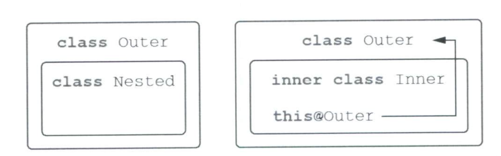

# 4. 클래스, 객체, 인터페이스

### 코틀린의 인터페이스

Kotlin 인터페이스는 Java 8 인터페이스와 비슷하지만 상태(필드)를 가질 수 없다.
아래 요소들을 포함할 수 있다.

- 추상 메소드
- 구현이 있는 메소드(default method)
- 프로퍼티
  - 추상 프로퍼티의 경우 해당 프로퍼티에 대한 커스텀 게터를 정의하거나 override 하여이를 초기화 해야한다.

> 같은 이름의 디폴트 메서드를 여러 인터페이스에서 상속받으면 모호성 오류가 발생한다.<br/>
이때 super<인터페이스명>.method() 형태로 어떤 인터페이스 구현을 호출할지 명시해야 한다.

#### 🔍 인터페이스 Default 메서드에 대한 팁
코틀린은 인터페이스의 default 메서드를 실제 바이트코드에서 DefaultImpls라는 별도 클래스에 저장한다. <br/>

- Java에서는 이 DefaultImpls가 자동 연결되지 않는다.
- 그래서 Java 코드에서 Kotlin 인터페이스를 상속하면 default 메서드를 직접 구현해야 한다.

### open, final, abstract 변경자 키워드

자바는 기본적으로 상속이 가능하다.<br/>
문제점: 상위 클래스의 필드, 메소드 변경시 하위 클래스에도 영향을 미친다.

따라서, 기본적으로 코틀린에서는 클래스와 메소드는 `final` 로 설정해 상속을 막는다.<br/>
상속을 하기 위해서는 `open` 키워드를 사용해야한다.<br/>
*(다만 override 의 경우에는 기본적으로 `open` 이기에 필요시 `final` 로 변환한다.*

### 추상 클래스

추상 클래스의 경우에는 추상 멤버가 항상 `open` 상태이다.<br/>
물론, 기본 함수의 경우에는 `final`이다.

| 변경자          | 이 변경자가 붙은 멤버는        | 설명                                                |
|--------------|----------------------|---------------------------------------------------|
| **final**    | 오버라이드할 수 없음          | 클래스/멤버의 기본 변경자. 상속 및 재정의 불가.                      |
| **open**     | 오버라이드할 수 있음          | Kotlin은 기본이 final이라, 오버라이드를 허용하려면 open을 명시해야 함.   |
| **abstract** | 반드시 오버라이드해야 함        | 추상 클래스/멤버에만 사용 가능. 구현이 있으면 안 됨.                   |
| **override** | 상위 멤버를 재정의하는 중이라는 의미 | override된 멤버는 기본적으로 열려 있음. 다시 막으려면 final을 명시해야 함. |

### 가시성 변경자
코틀린은 자바와 다르게 `internal` 이라는 접근 제한자를 지원한다.<br/>
internal: 모듈(패키지) 내부에서만 볼수 있는 접근 제한자

> 대표적인 internal 실패 상황<br/>
> `public` 함수가 `internal` 타입을 사용하고자 할때 오류가 난다.

1. 코틀린의 `public`, `protected`, `private`는 컴파일된 자바 바이트코드에서도 그대로 유지된다.
2. 하지만 `internal`은 자바에 대응 개념이 없어 **바이트코드에서는 사실상 public**으로 변환된다.
3. 이 때문에 자바에서는 원래 접근하면 안 되는 internal 멤버에 접근 가능해 보이는 경우가 생긴다.
4. 대신 코틀린은 internal 멤버 이름을 **의도적으로 난독화(mangle)** 하여 실수로 사용하지 못하게 한다. 
5. 이는 상속 시 충돌 방지와 외부 모듈에서 internal을 잘못 사용하는 것을 막기 위한 장치이다.


| 변경자       | 클래스 멤버에서의 의미                        | 최상위 선언에서의 의미                    |
|--------------|-----------------------------------------------|-------------------------------------------|
| **public** (기본 가시성) | 모든 곳에서 볼 수 있다                     | 모든 곳에서 볼 수 있다                    |
| **internal** | 같은 모듈 안에서만 볼 수 있다                 | 같은 모듈 안에서만 볼 수 있다             |
| **protected** | 하위 클래스 안에서만 볼 수 있다              | 적용할 수 없음 (최상위 선언에는 사용 불가) |
| **private**  | 같은 클래스 안에서만 볼 수 있다               | 같은 파일 안에서만 볼 수 있다             |

### 중첩 클래스
코틀린에서 중첩 클래스를 아무것도 작성하지 않으면, 단순 static 클래스로 사용 된다.
이를 내부 클래스로 바꾸어서 외부 클래스에대한 참조를 가지고 싶으면 `inner` 키워드를 붙여야만 한다.

Kotlin에서 중첩 클래스를 선언하면 기본적으로 static nested class가 된다.
즉 외부 클래스 인스턴스에 접근할 수 없다.

외부 클래스에 접근하려면 아래와 같이 사용한다.
```kotlin
inner class Foo
```

<div align="center">


</div>

### sealed class
sealed 는 하위 클래스를 제한할 수 있는 방법으로 sealed 클래스 내부에 하위 클래스를 정의해
제한할 수 있다.<br/>
이를 통해 when 문 사용시에 else 와 같은 특정 예외 상황이 오는 것을 방지 할 수 있다.

- sealed 클래스는 기본적으로 `open` 상태를 가진다. 

### 생성자와 프로퍼티 선언
코틀린에서는 생성자를 주 생성자와 부생성자로 분리해서 관리한다. 
또한, 초기화 블록을 통해 초기화 로직을 추가할 수도 있다.

클래스 괄호 안에 매개변수와 같이 작성하는 코드를 주생성자라고 부른다.<br/>
부생성자는 constructor로 정의하며, 부생성자가 있다면 주 생성자를 반드시 작성할 필요는 없다.

```kotlin
// 1. constructor + init + 별도 프로퍼티
class User constructor(_nickname: String) {  // 파라미터만 있는 주 생성자
val nickname: String                     // 프로퍼티 선언

    init {                                   // 초기화 블록
        nickname = _nickname                 // 프로퍼티 초기화
    }
}

// 2. 프로퍼티 선언과 초기화
class User constructor(_nickname: String) {
    val nickname = _nickname     // 프로퍼티를 선언하면서 동시에 초기화
}

// 3. 주 생성자 파라미터 = 프로퍼티
class User(val nickname: String)
```

#### 비공개(private) 생성자를 쓰는 이유
private constructor()를 쓰면 외부에서 클래스 인스턴스를 만들 수 없다.<br/>
이런 클래스는 보통 유틸리티 함수만 담거나, 싱글톤 패턴처럼 외부 생성이 필요 없는 경우 사용된다.

객체는 오직 동반 객체(companion object) 또는 팩토리 메서드를 통해서만 생성하도록 강제할 수 있다.
자바는 이런 제약을 언어 차원에서 지원하지 않아 private 생성자로 막아야 한다.

코틀린은 싱글톤이나 유틸리티 클래스 등에서 이런 구조를 자연스럽게 사용할 수 있게 해준다.

외부에서 인스턴스를 만들 수 없도록 제한하려는 경우:
- 유틸리티 클래스
- 싱글턴
- 팩토리 메서드 강제

> 모든 생성자 파라미터에 디폴트 값을 지정할 경우, 컴파일러가 자동으로 파라미터가 없는
> 생성자를 만들어준다. DI 프레임 워크도 파라미터가 없는 생성자를 이용한다.

### 데이터 클래스
1. data class는 값(value) 을 담는 클래스에 특화된 문법이다.
2. 컴파일러가 equals(), hashCode(), toString(), copy() 등을 자동 생성해준다.
3. 주 생성자(primary constructor) 안에 최소 1개 이상 val 또는 var 프로퍼티가 있어야 한다.
4. 불변 객체 모델링에 적합하며, 구조 분해 선언(componentN()) 기능도 자동 제공된다. 
5. 클래스가 데이터 보관 외 복잡한 로직이 없다면 data class가 가장 적합하다.

### 클래스 위임 by 키워드
- 데코레이터 패턴을 지원하기 위한 키워드
- 데코레이터 패턴: 어떤 기능을 자신이 수행하지 않고 다른 객체가 수행하도록 하는 패턴
#### 목적
- **상속 대신 조합(composition)과 위임(delegation)을 쉽게 사용**하도록 지원
- by 키워드를 통해 인터페이스 구현을 **내부 객체에 자동 위임**

```kotlin
class CountingSet<T>(
    private val innerSet: MutableCollection<T> = HashSet()
) : MutableCollection<T> by innerSet {
    var objectsAdded = 0

    override fun add(element: T): Boolean {
        objectsAdded++
        return innerSet.add(element)
    }
}
```
필요한 부분만 override 하여 구현할 수 있다.

### 인스턴스 생성 object 키워드
싱글턴 패턴을 구현하기 위한 키워드

무명 객체를 정의 할때도 이를 사용한다.
```kotlin
val listener = object: MouseAdapter() {
    override fun mouseClicked(e: MouseEvent) { ... }
    override fun mouseEntered(e: MouseEvent) { ... }
}
```

### 동반 객체
팩토리 패턴을 구현하기 위한 키워드

```kotlin
class User private constructor(val name: String, val age: Int) {

    companion object {
        fun fromName(name: String): User = User(name, 0)
        fun fromAge(age: Int): User = User("Unknown", age)
    }
}

// 외부에서는 이런 식으로만 생성 가능
val a = User.fromName("승준")
val b = User.fromAge(20)
```
