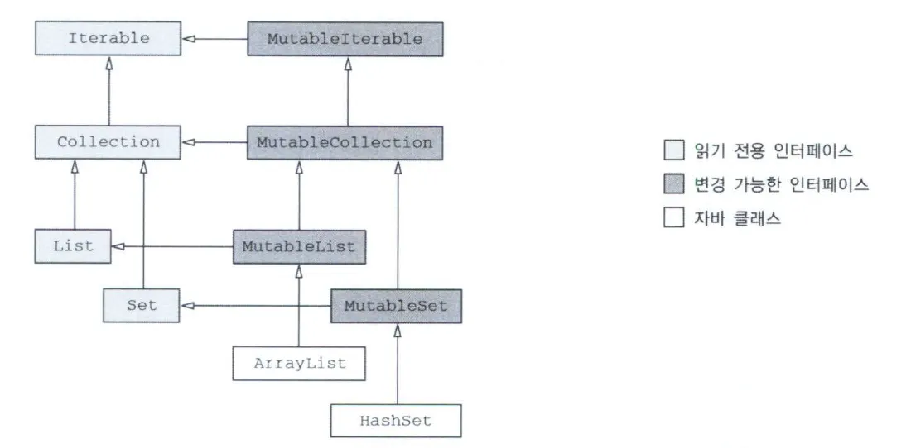
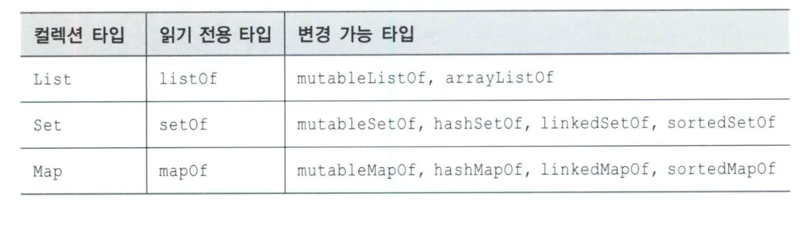

# 6. 코틀린 타입 시스템

> > 용어 및 개념 정리
> > **java** 에서 `NullPointerException` 다루기
> > - 자바에서 널이 될 수 있는지 여부를 표시하는 어노테이션을 지원
      `@Nullable`, `@NotNull`
> > - null 을 감싸는 특별한 래퍼 타입인 Optional 을 사용
      어떠한 값이 정의디거나 정의 되지 않을 수 있음을 나타냄.<br/>
>
>> 플랫폼 타입
> 코틀린이 널 관련 정보를 알 수 없는 타입<br/>
> 자바에서의 기본 타입 선언 시와 마찬가지로 코틀린에서 플랫폼 타입 사용시<br/>
> null 처리를 수행하거나 수행하지 않아도 사용이 가능하다.<br/>
> 자바에서 null 가능성에 대한 정보가 없는 경우, (컴파일러에서) `String!` 과 같이 표기한다.<br/><br/>
> 자바의 경우에는 원시타입과 참조타입을 구분해서 사용한다.
> > 컬렉션 같은 제네릭 타입 경우에는 래퍼 클래스로 감싸서 사용한다.
> > 코틀린의 경우 원시타입, 래퍼타입을 구분하지 않고 사용한다.
> > 따라서 기본적으로는 `Int`, 컬렉션의 경우 `Integer` 로 변환되어 저장된다.
>
>> 코틀린은 숫자에서의 자동 타입 변환을 자동으로 하지 않는다.<br/>
> > → 개발자의 혼란을 막기 위해 `equals` 의 경우도 객체 타입을 비교하기 떄문에 `in` 같은 키워드도 타입이 다르면 `false` 가 나온다.<br/>

## 널처리 연산자

코틀린에서는 널이 될 수 있는 타입을 명시적으로 지원한다.

따라서 컴파일 시점에 모든 널 타입에 객체에 대해 검사를 수행한다.

### **null-safe 연산자 `?.`**

`?.` 은 null 이 아니면 해당 값을, null 이면 null 을 반환하는 값을 반환한다.

해당 타입을 통해 null 값을 받을 수 있다.

if 문으로 null 체킹 하는 코드를 줄일 수 있다는 장점이 있다.

### **엘비스 연산자 `?:`**

null 대신 반환한 값을 체킹 할 때 사용한다.

```kotlin
fun foo(s: String?): Int = s?.length ?: 0
```

`return` 과 `throw` 도 하나의 연산식이기에 엘비스 연산자의 우항에 해당 연산을 전달 가능하다.

함수내에서 조건을 만족하지 못할 경우 해당 함수를 종료하고자 할 때 주로 사용

### **Safe-Casting 연산자 `as?`**

`is` 연산자를 통해 변환 가능한 타입인지 검사 가능하나,

`as` 를 통해 타입 캐스팅을 시도하고, `as?` 를 통해서 캐스팅 실패시 `null` 을 반환하게 할 수 있다.

예를 들어

```kotlin
class Person(val firstName: String, val lastName: String) {
    fun equals(o: Any?): Boolean {
        val otherPerson = o as? Person ?: return false

        return otherPerson.firstName == firstName
    }
}
```

위와 같이 as 캐스팅 실패시 `?:` 과 함께 사용해 해당 함수를 종료 할 수 있다.

### **Not-Null assertion 연산자 `!!`**

널이 될 수 없는 타입으로 변환 해당 연산자를 사용할 경우, 널인 값은 NPE 발생

NPE 발생시에 해당 줄에 대한 예외가 발생하기 때문에 한줄에 여러 `!!` 연산자를 사용하는 것은 피해야한다.

### **`let` 함수**

**i**f 조건식으로 `null` 체킹 하는것 보다 바로 `?.let` 구문을 통해 해당 값이 `null` 이 아님을 보장하면서 해당 람다식 안에서 `null` 이 아닌 값을 사용할 수 있다.

다만, `let` 을 중첩해서 사용하는 경우, 복잡해져 보이기 때문에 if 문을 사용해 모든값을 한번에 검사하는 편이 더 낫다.

### **나중에 초기화할 프로퍼티**

클래스 내에서 널이 될 수 없는 프로퍼티를 생성자 안에서 초기화 하지 않고 사용하고자 할 때

`lateinit var` 키워드를 통해 지연 초기화를 할 수 있다.

### **그밖에 null 처리 확장 함수**

String 의 경우 해당 값이 비어 있는지 확인하기 위해 `isEmpty` 혹은 `isBlank` 를 사용할 수 있다. 다만 해당 String 값이 nullable 한 타입일 경우 isEmpty 를 사용하기
위해서는 `?.isEmpty` 와 같이 사용해야한다. 이렇게 사용하지 않고 함수 자체에서 null 이 될 수 있는 값을 받고 이에 대한 값을 처리하는 함수가 존재한다.

`isNullOrEmpty` 혹은 `isNullOrBlank` 가 있다.

### **타입 파라미터의 널 가능성**

제네릭과 같은 T 타입과 같은 경우, `<T>` 는 모든 타입이 가능하기 때문에 Any? 타입으로 선언되어 nullable 한 타입이 된다.

다만 `<T: Any>` 와 같이 사용할 경우 해당 타입은 Non-Nullable 한 타입이기 때문에 해당 T 타입에 대해서 null 처리를 수행하지 않아도 괜찮다.

### Null 가능성과 자바

자바와 코틀린을 상호운용성을 지원하기 위해 코틀린에서 nullable 한 연산자를 자바에서는 어노테이션을 활용해서 적용한다.

- `@Nullable String === String?`
- `@NotNull String === String`

코틀린이 이해할 수있는 어노테이션에는 아래와 같이 있다.

- JSR-305 표준 : `javax.annotation` 패키지
- 안드로이드: `android.support.annotation` 패키지
- 젯브레인스 도구: `org.jetbrains.annotations`

자바 API 경우에는 널 관련 어노테이션이 적용되어 있지 않기 때문에 이를 유의해서 사용해야한다.

자바 인터페이스 경우도 타입에 따라서 반환 타입이 널이 될수 있는 타입인지 아닌지를 결정해서 구현 가능하다.

## 코틀린 타입

### 최상위 타입 `Any`, `Any?`

자바에서 Object 가 최상위 타입인 것과 같이 코틀린에서는 Any 타입이 Non-Nullable 한 타입의 최상위 타입이다.

자바와 다르게 `Int` 도 `Any` 타입을 상속 받아 사용한다.

`Any` 는 `toString`, `equals`, `hashCode` 메소드를 정의한다.

### 코틀린의 void `Unit` 타입

코틀린에서는 자바의 `void` 와 비슷한 타입으로 `Unit` 타입을 사용한다.

코틀린에서 `Unit` 타입을 사용해서 제네릭 함수를 오버라이드 하지 않는 다면 그 함수는 `void` 함수로 컴파일 된다.

> `Unit` 은 `void` 와 다르게 타입에 `Unit` 을 사용할 수 있다. 따라서 반환시에 반환 값이 `Unit` 이게 된다.
>
>
> 자바에서`void`와`Void`는 차이가 있다.
>
> `void`(소문자) 는**원시타입**으로**반환 값이 존재하지 않음**을 이야기하고`Void`는**객체타입**으로**객체가 존재하지 않음**을 말한다.
>
> 따라서`Void`에는 리턴 값으로`null`을 반환 해야 한다.
>

### Nothing 타입

`Nothing`은`private 생성자`로 생성자에 접근 할 수 없어 인스턴스를 가지지 않는다. *(object 키워드의 싱글톤 처럼 구현되어 있음)*

**fail** 함수의 경우도 Nothing 을 이용한 타입이다.

[해당 블로그 글 참고](https://velog.io/@last_game/Kotlin-Nothing)

## 컬렉션과 배열

코틀린에서는 자바 컬렉션의 인터페이스를 사용해서 코틀린 컬렉션의 인스턴스를 구성한다. 따라서 코틀린에서 자바 사이 변환시에 아무 변환을 거치지 않는다.

### 읽기 전용, 변경 가능한 컬렉션

코틀린에서는 컬렉션 내에 데이터에 접근하는 인터페이스와 데이터를 변경하는 인터페이스를 분리해서 사용한다.

기본적인 읽기 전용 컬렉션: `kotlin.collections.Collection`

변경 가능한 컬렉션: `kotlin.collections.MutableCollection`



코틀린에서 ArrayList 는 마치 MutableList 를 상속하고 있는 것과 같이 작동한다.

MutableCollection 에 Collection(읽기 전용 컬렉션)값을 전달할 경우에는 값에 대한 변경을 없게 하기 위해 해당 컬렉션을 그대로 주지 않고 copy 를 사용해 복사해서 전달해야한다.

> 단순 collection 전달시에 참조를 전달하게 되어 MutableCollection 이 값을 변경할 수 있기 때문이다 !!
>
> 또한, 이러한 경우 쓰레드 병렬적으로 실행한다면 해당 컬렉션의 내용을 도중에 변경 할 수 있어 data race 가 발생할 수 있다. 따라서 읽기 전용 컬렉션도 항상 스레드 안전하다고 보장 할 수 없다.
>
>또한 자바에서 null 이 컬렉션에 가능하기 때문에 이부분을 유의해서 작성해야한다.




### 컬렉션과 배열

기본적으로 배열을 만들고자 한다면 `arrayOf` 를 사용한다.

null 을 기본값으로 하는 배열을 만든다면 `arrayOfNulls` 를 사용한다.

데이터가 이미 컬렉션에 있다면 `toTypedArray` 를 사용해 컬렉션을 배열로 변환한다.

```kotlin
val strings = listOf("a", "b", "c")
println("%s%s%s".format(*strings.toTypedArray()) // varage 인자를 넘기기 위해 스프레드 연산자(*) 사용
```

원시 타입의 배열을 표현하는 클래스를 제공하여 객체가 아닌 원시타입, 즉 `int[]` 와 같이 컴파일 되게한다.

```kotlin
val fiveZeros = IntArray(5)
val fiveZerosToo = intArrayOf(0, 0, 0, 0, 0)
val squares = IntArray(5) { i -> (i + 1) * (i + 1) } // 람다 방식
```

컬렉션에서 사용할 수 있는 모든 확장 함수를 배열에도 제공한다.
